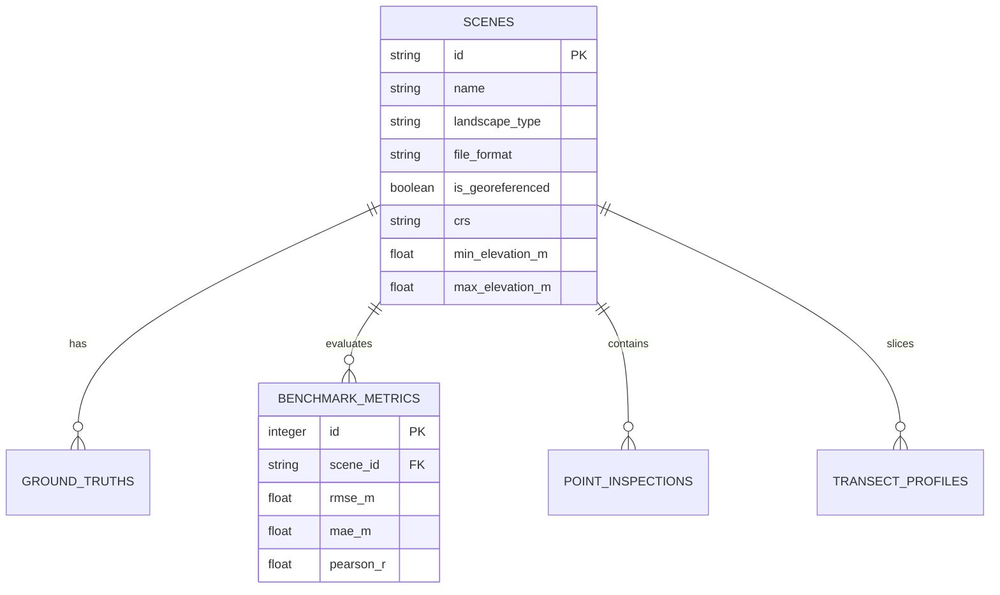

# 🗄️ Database & Storage Architecture
## Project DepthWizard — ISRO Problem Statement 26175

---

## 1. What does the Database actually do? (Plain-English Explanation)

A common student confusion in geospatial apps is:  
*"Do we store giant 50-Megabyte satellite photos and 3D terrain meshes inside database rows?"*  
**The answer is NO!**

Storing huge images inside a database makes it slow and causes memory crashes.  
Instead, we use the **Hybrid File + Database Pattern**:
- **The File System (Hard Drive):** Stores the heavy raster files (the `.png` optical photo, the `.tif` height map, and the 16-bit texture).
- **The Database (`depth.db`):** Acts like a clean **Library Card Catalog**. It stores the file paths, scene names, geographic coordinates, GPS bounding boxes, measured building heights, and benchmark scores.

```
📁 File System (/data/)                  🗄️ SQLite Database (depth.db)
├── optical/scene_01.png ◀────────────── (Path stored in 'scenes' table)
├── dsm/scene_01_metric.tif ◀─────────── (Path stored in 'scenes' table)
└── ground_truth/scene_01_gt.tif ◀────── (Path stored in 'ground_truths' table)
                                         ├── Scene Metadata (CRS, Bounding Box)
                                         ├── Benchmark Metrics (RMSE: 3.82m)
                                         └── Saved Point Heights (Tower: 54m)
```

---

## 2. Why SQLite?
- **Zero Config:** It is already built right into Python (`import sqlite3`). You don't have to install PostgreSQL, configure users, or remember passwords.
- **Single File:** The entire database lives in one file called `depth.db` in the project root.
- **Fast & Lightweight:** Consumes almost zero RAM on your Intel Core i3 laptop.

---

## 3. The 5 Database Tables & Data Schema

Here are the 5 simple tables in our `depth.db`:



---

### Table 1: `scenes` (The Primary Scene Registry)
Stores every uploaded or pre-loaded satellite scene.

| Column Name | Data Type | Description | Example Value |
| :--- | :--- | :--- | :--- |
| `id` | TEXT (PK) | Unique ID for the scene | `"urban-ahmedabad-01"` |
| `name` | TEXT | Human-readable title | `"Ahmedabad Urban High-Rise"` |
| `landscape_type` | TEXT | Terrain category | `'urban'`, `'sparse'`, `'mountain'`, `'forest'` |
| `file_format` | TEXT | Original upload format | `'png'`, `'jpg'`, `'tif'`, `'h5'` |
| `is_georeferenced`| INTEGER | 1 = GeoTIFF (Metric), 0 = Relative | `1` |
| `crs` | TEXT | Coordinate Reference System | `'EPSG:32643'` or `'None'` |
| `bbox_min_x` | REAL | Western-most coordinate / longitude | `72.5012` |
| `bbox_min_y` | REAL | Southern-most coordinate / latitude | `23.0114` |
| `bbox_max_x` | REAL | Eastern-most coordinate / longitude | `72.5428` |
| `bbox_max_y` | REAL | Northern-most coordinate / latitude | `23.0456` |
| `optical_path` | TEXT | Local file path to optical RGB image | `"/data/optical/scene_01.png"` |
| `dsm_path` | TEXT | Local file path to estimated DSM | `"/data/dsm/scene_01_dsm.tif"` |
| `height_texture` | TEXT | Path to 16-bit PNG for Three.js | `"/data/cache/scene_01_disp.png"` |
| `min_elevation_m`| REAL | Minimum calculated elevation | `42.5` |
| `max_elevation_m`| REAL | Maximum calculated elevation | `184.2` |
| `created_at` | TEXT | ISO timestamp | `"2026-09-04T12:00:00Z"` |

---

### Table 2: `ground_truths` (Reference Comparison Store)
Stores the reference elevation rasters (Copernicus 30m / LiDAR) used to prove accuracy to the evaluators.

| Column Name | Data Type | Description | Example Value |
| :--- | :--- | :--- | :--- |
| `id` | INTEGER (PK)| Auto-increment ID | `1` |
| `scene_id` | TEXT (FK) | Links to `scenes.id` | `"urban-ahmedabad-01"` |
| `gt_source` | TEXT | Source of reference | `'Copernicus-GLO-30'`, `'SRTM-30m'`, `'LiDAR'` |
| `gt_dsm_path` | TEXT | File path to ground truth GeoTIFF | `"/data/gt/copernicus_ahmedabad.tif"` |
| `vertical_datum`| TEXT| Reference sea level model | `'EGM96'` or `'WGS84 Ellipsoid'` |
| `resolution_m` | REAL | Grid pixel size in meters | `30.0` |

---

### Table 3: `benchmark_metrics` (The Winning Scorecard)
Stores the calculated statistical accuracy scores so the frontend can populate the judge's score table immediately.

| Column Name | Data Type | Description | Example Value |
| :--- | :--- | :--- | :--- |
| `id` | INTEGER (PK)| Auto-increment ID | `1` |
| `scene_id` | TEXT (FK) | Links to `scenes.id` | `"urban-ahmedabad-01"` |
| `landscape_type`| TEXT | Matches ISRO criteria | `'urban'` |
| `rmse_m` | REAL | Root Mean Square Error (meters) | `3.82` |
| `mae_m` | REAL | Mean Absolute Error (meters) | `2.61` |
| `pearson_r` | REAL | Correlation coefficient (0 to 1) | `0.89` |
| `evaluated_at` | TEXT | Timestamp of calculation | `"2026-09-04T14:30:00Z"` |

---

### Table 4: `point_inspections` (Saved Building & Point Queries)
When you click a building on the 3D map during the live demo, it can be saved here so you can show evaluators pre-measured landmarks.

| Column Name | Data Type | Description | Example Value |
| :--- | :--- | :--- | :--- |
| `id` | INTEGER (PK)| Auto-increment ID | `1` |
| `scene_id` | TEXT (FK) | Links to `scenes.id` | `"urban-ahmedabad-01"` |
| `label` | TEXT | Name of landmark | `"Tower A Rooftop"` |
| `pixel_x` | INTEGER | Image pixel X coordinate | `512` |
| `pixel_y` | INTEGER | Image pixel Y coordinate | `420` |
| `lat` | REAL | Estimated Latitude | `23.0225` |
| `lon` | REAL | Estimated Longitude | `72.5714` |
| `elevation_z_m` | REAL | Elevation above sea level (meters) | `418.2` |
| `height_agl_m` | REAL | Building height above ground | `54.6` |

---

### Table 5: `transect_profiles` (2D Cross-Section Profiles)
Stores the 2-point elevation cross-section line drawn by the user.

| Column Name | Data Type | Description | Example Value |
| :--- | :--- | :--- | :--- |
| `id` | INTEGER (PK)| Auto-increment ID | `1` |
| `scene_id` | TEXT (FK) | Links to `scenes.id` | `"urban-ahmedabad-01"` |
| `start_x` | INTEGER | Start pixel X | `120` |
| `start_y` | INTEGER | Start pixel Y | `200` |
| `end_x` | INTEGER | End pixel X | `800` |
| `end_y` | INTEGER | End pixel Y | `750` |
| `profile_json` | TEXT | Array of elevation heights along line | `"[350.2, 351.0, 374.5, 412.0, ... ]"` |

---

## 4. Ready-to-Run SQLite Creation Script (`init_db.py`)

Dheer or you can run this single script to create the entire database in 2 seconds:

```python
import sqlite3

def init_database(db_path="depth.db"):
    conn = sqlite3.connect(db_path)
    cur = conn.cursor()

    cur.executescript("""
    CREATE TABLE IF NOT EXISTS scenes (
        id TEXT PRIMARY KEY,
        name TEXT NOT NULL,
        landscape_type TEXT NOT NULL,
        file_format TEXT NOT NULL,
        is_georeferenced INTEGER DEFAULT 0,
        crs TEXT,
        bbox_min_x REAL,
        bbox_min_y REAL,
        bbox_max_x REAL,
        bbox_max_y REAL,
        optical_path TEXT NOT NULL,
        dsm_path TEXT NOT NULL,
        height_texture TEXT,
        min_elevation_m REAL,
        max_elevation_m REAL,
        created_at DATETIME DEFAULT CURRENT_TIMESTAMP
    );

    CREATE TABLE IF NOT EXISTS ground_truths (
        id INTEGER PRIMARY KEY AUTOINCREMENT,
        scene_id TEXT NOT NULL,
        gt_source TEXT NOT NULL,
        gt_dsm_path TEXT NOT NULL,
        vertical_datum TEXT,
        resolution_m REAL,
        FOREIGN KEY(scene_id) REFERENCES scenes(id)
    );

    CREATE TABLE IF NOT EXISTS benchmark_metrics (
        id INTEGER PRIMARY KEY AUTOINCREMENT,
        scene_id TEXT NOT NULL,
        landscape_type TEXT NOT NULL,
        rmse_m REAL NOT NULL,
        mae_m REAL NOT NULL,
        pearson_r REAL NOT NULL,
        evaluated_at DATETIME DEFAULT CURRENT_TIMESTAMP,
        FOREIGN KEY(scene_id) REFERENCES scenes(id)
    );

    CREATE TABLE IF NOT EXISTS point_inspections (
        id INTEGER PRIMARY KEY AUTOINCREMENT,
        scene_id TEXT NOT NULL,
        label TEXT,
        pixel_x INTEGER NOT NULL,
        pixel_y INTEGER NOT NULL,
        lat REAL,
        lon REAL,
        elevation_z_m REAL NOT NULL,
        height_agl_m REAL NOT NULL,
        created_at DATETIME DEFAULT CURRENT_TIMESTAMP,
        FOREIGN KEY(scene_id) REFERENCES scenes(id)
    );

    CREATE TABLE IF NOT EXISTS transect_profiles (
        id INTEGER PRIMARY KEY AUTOINCREMENT,
        scene_id TEXT NOT NULL,
        start_x INTEGER NOT NULL,
        start_y INTEGER NOT NULL,
        end_x INTEGER NOT NULL,
        end_y INTEGER NOT NULL,
        profile_json TEXT NOT NULL,
        created_at DATETIME DEFAULT CURRENT_TIMESTAMP,
        FOREIGN KEY(scene_id) REFERENCES scenes(id)
    );
    """)

    conn.commit()
    conn.close()
    print("DepthWizard SQLite database initialized successfully: depth.db")

if __name__ == "__main__":
    init_database()
```
